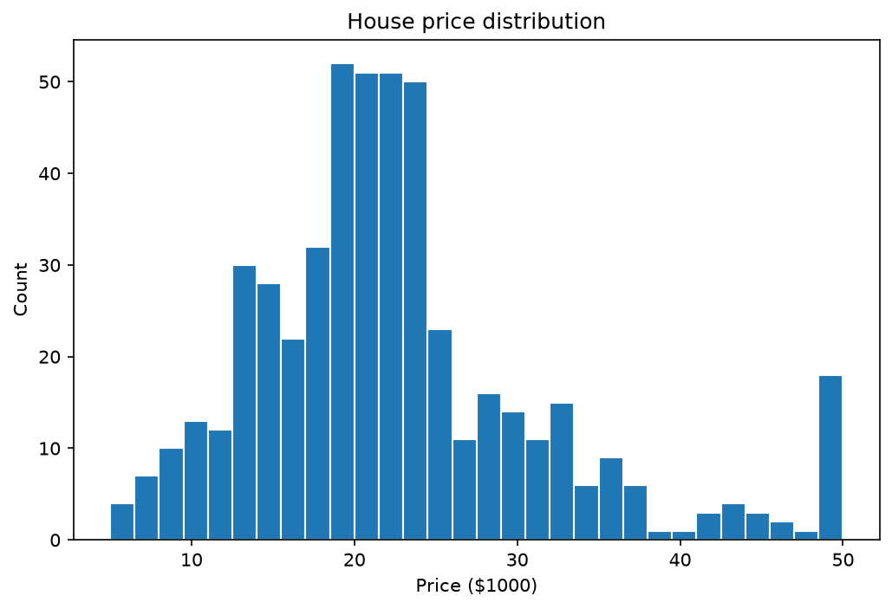
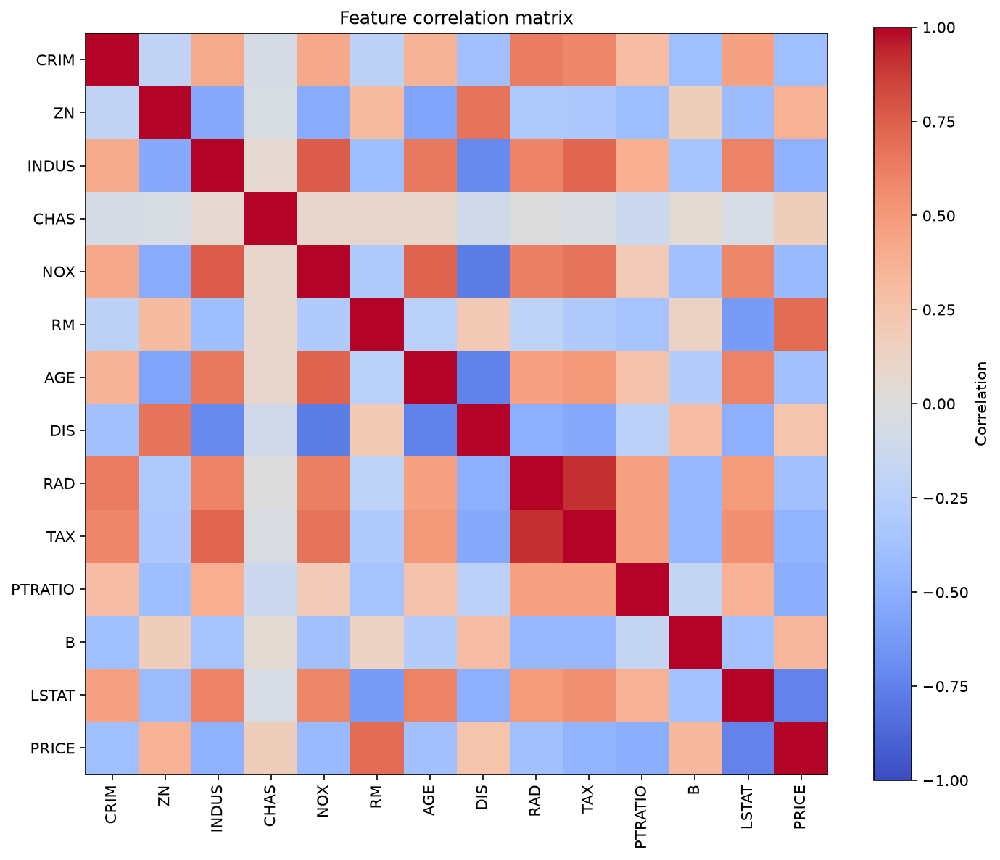
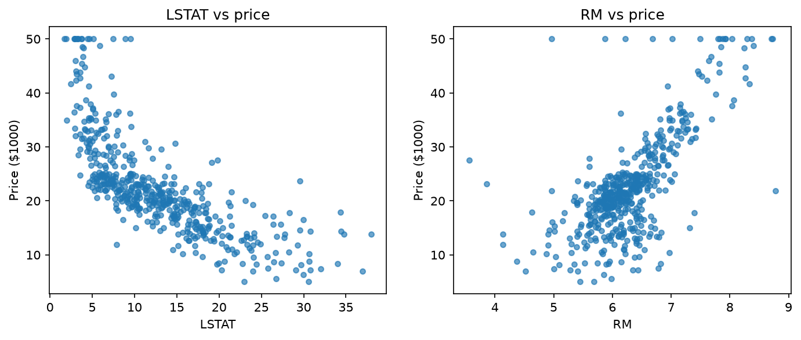

# Boston Housing Analysis with scikit-learn

This project demonstrates a small, reproducible regression workflow for the
Boston housing dataset: data loading, tabular analysis, optional EDA plots,
and comparison of linear, Ridge, and Lasso regression.

The dataset is loaded from OpenML because `sklearn.datasets.load_boston` was
removed from scikit-learn. The first run requires network access to download
the cached dataset.

## Run

```bash
python -m pip install -r requirements.txt
python boston_house_sklearn.py
python boston_house_sklearn.py --plots
```

The command writes `dataset_summary.csv`, `model_results.csv`, and current EDA
plots to `outputs/`.

## Current EDA







## Modules

- `data.py`: loading and validating features and target
- `analysis.py`: quality summaries and correlations
- `eda.py`: optional matplotlib visualizations
- `modeling.py`: reproducible train/test and cross-validation evaluation
- `boston_house_sklearn.py`: command-line entry point